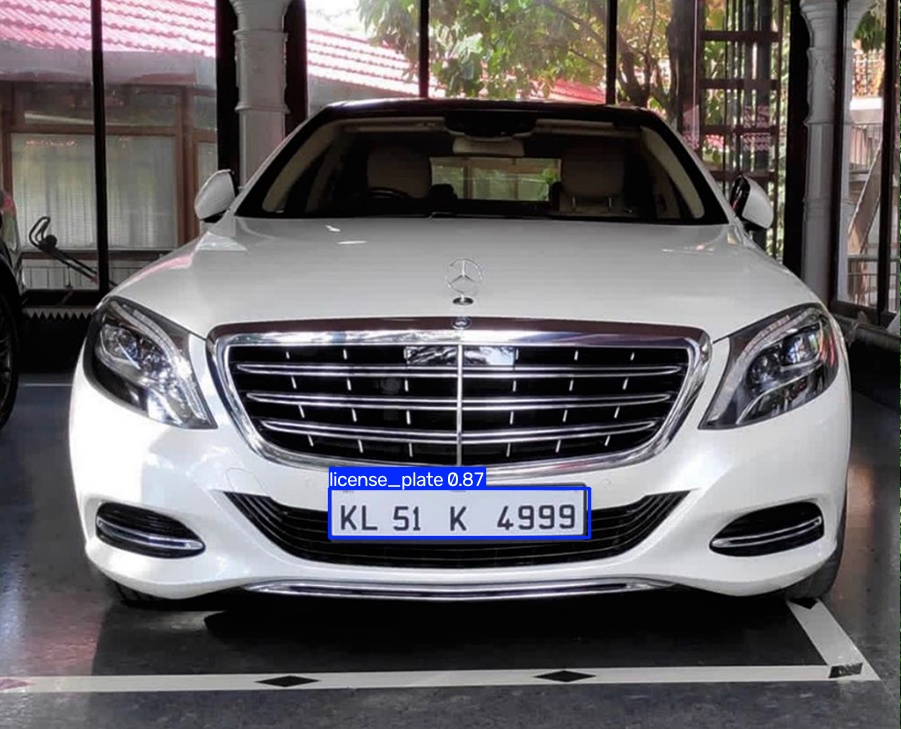

# 🚗 AI 多功能車牌影像辨識系統 (AI Car Plate Recognition System)

基於 **YOLOv8 物件偵測**與 **EasyOCR 文字辨識**開發的雙階段（Two-stage）自動車牌辨識系統（ANPR）。專案採用 **Streamlit** 打造中文化網頁互動介面，並針對本機 **NVIDIA GPU** 進行了批量推理加速（Batch Inference）優化，支援圖片與大體積影片的即時處理、日誌輸出與成果下載。

## 🌟 功能亮點
- 🗂️ **雙模組分頁介面**：清晰分隔「圖片辨識」與「影片辨識」功能。
- 🔍 **精準車牌定位**：利用客製化微調的 YOLOv8 模型，`mAP50-95` 達到 81.6% 的極高定位準確度。
- 🔤 **單例模式 OCR 辨識**：採用 **Singleton Pattern** 初始化 EasyOCR 模型，防止記憶體與顯存（VRAM）重複載入爆炸，精確提取真實車牌英數字。
- ⚡ **GPU 批量加速推理**：影片處理支援 `Batch Size = 16` 的批量加速，完美釋放 NVIDIA 顯示卡效能。
- 📝 **動態系統日誌**：前端文字方塊即時同步 Python 後台 `print` 輸出，提供優良的使用者體驗。
- 💾 **一鍵壓縮與下載**：內建 `FFmpeg` 自動轉碼技術，處理後的影片與圖片皆能即時在線網頁播放並提供下載。

## 🛠️ 環境需求
- Python 3.9+
- NVIDIA 顯示卡（推薦，需配置 CUDA 環境）
- 本機系統需安裝 [FFmpeg](https://ffmpeg.org) 並加入環境變數（用於影片轉碼壓縮）

## 🚀 快速開始指南

### 1. 複製本專案與建立虛擬環境
```bash
git clone https://github.com
cd car_plate_app

python -m venv .venv
```
*啟用虛擬環境：*
- Windows: `.venv\Scripts\Activate.ps1`
- Mac/Linux: `source .venv/bin/activate`

### 2. 安裝必要套件
請確保你的虛擬環境已啟用，依序執行：
```bash
# 安裝核心套件
pip install streamlit ultralytics opencv-python matplotlib easyocr

# (選擇性) 如果你有 NVIDIA 顯卡，請安裝支援 CUDA 的 PyTorch 享用硬體加速：
pip uninstall torch torchvision -y
pip install torch torchvision --index-url https://pytorch.org
```

### 3. 配置權重檔案
請將訓練完成的 YOLOv8 最佳權重檔案命名為 **`best.pt`**，並直接放置於專案根目錄下。

### 4. 啟動 Streamlit 網頁服務
執行以下指令啟動系統（指令已自動放寬 Streamlit 預設的 200MB 上傳限制至 2GB）：
```bash
streamlit run app.py --server.maxUploadSize 2048
```
服務啟動後，瀏覽器會自動開啟 `http://localhost:8501`。

## 📁 專案架構
```text
car_plate_app/
├── .streamlit/
│   └── config.toml          # Streamlit 設定檔
├── .gitignore               # Git 忽略清單
├── LICENSE                  # 開源授權書
├── README.md                # 專案說明文件
├── app.py                   # Streamlit 網頁主程式
├── ocr_module.py            # 單例模式 OCR 文字辨識模組
└── test_license_car_plate.py# YOLO 偵測與影片處理核心邏輯
```


## 📊 辨識成果展示 (Results Demo)

### 📸 圖片車牌辨識 (YOLOv8 + EasyOCR)
成功定位車牌並將局部影像切片送入單例文字辨識模組，精確提取英數字號碼：



### 🎬 影片批量加速偵測 (GPU Batch = 16)
*提示：影片檔案已透過 Issue 附件優化上傳，可在瀏覽器直接在線觀看辨識與綠框追蹤效果。*

[請在這邊貼上你從 GitHub Issues 拖曳影片後自動生成的 https://github.com... 網址]
